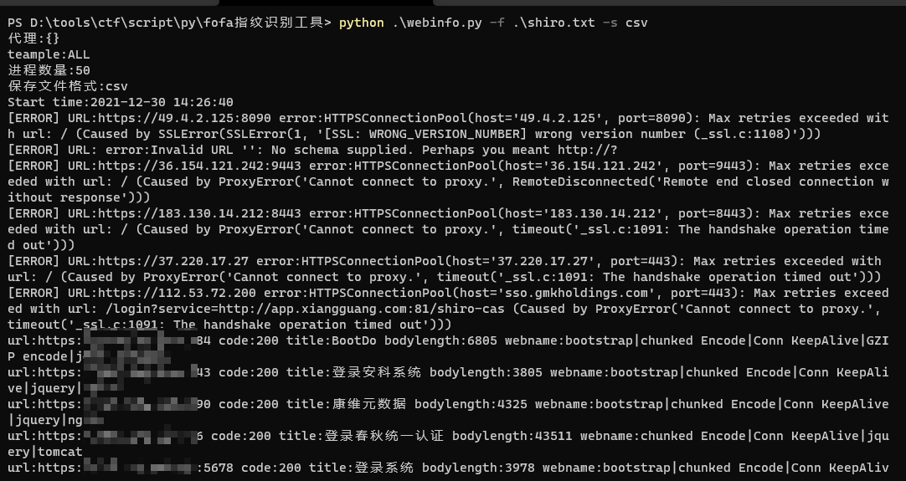
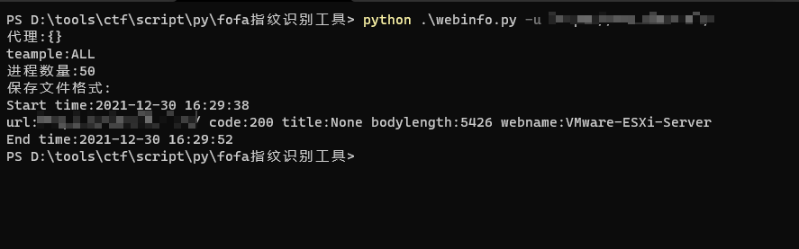

## fofa指纹识别 ##
json解析
```text
name # 指纹名称
author # 作者
version # 版本
matches[
    search #搜索type(可为:body|headers|title)
    "<匹配类型>" # 可为:text|regexp
] # 匹配规则
condition # 特殊条件 (无condition代表满足matches里面的任意一个search即可|有condition则根据规则来)
```

**解压rules.7z到当前目录**  

usage
```text
Usage: webinfo.py [options]

Options:
  -h, --help  show this help message and exit
  -u URL      单独url检测
  -f FILE     批量检测
  -t TEAMPLE  指定模板检测,批量模板检测
  -s SAVE     保存文件类型:txt|csv|json
  -i PROCESS  进程数量(default:50)
  -l          列出支持的指纹
  -p PROXY    指定代理,Example:http://127.0.0.1:8080 | socks5://127.0.0.1:1080

Example
python webinfo.py -u <url> [option]
python webinfo.py -u <url> -t <teample> [option]
python webinfo.py -f <file> [option]
python webinfo.py -f <file> -t <teample> [option]

python webinfo.py -u http://127.0.0.1 #全部模板检测
python webinfo.py -u http://127.0.0.1 -t zabbix,weblogic #指定检测zabbix和weblogic模板
python webinfo.py -u http://127.0.0.1 -p socks5://127.0.0.1:1118 #指定代理
python webinfo.py -u http://127.0.0.1 -s txt #保存文件
```




## 目前缺点 ##
- [ ] 指纹太多不指定匹配特定的话，批量扫描匹配有些慢
- [ ] 暂未发现的BUG
